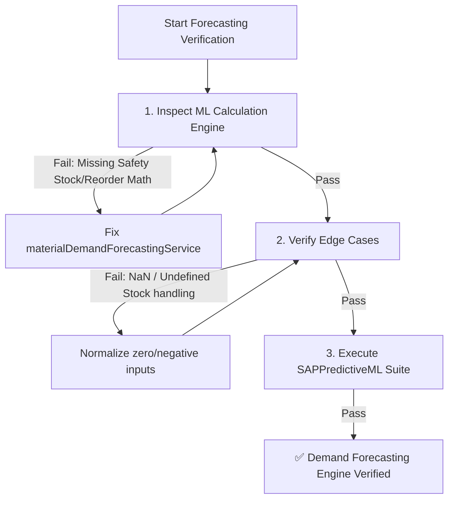

# Material Demand Forecasting & ML Validator Skill

This skill defines the verification procedure for predictive machine learning algorithms in **Clon SAP / Operam ERP Enterprise**, specifically for material replenishment, safety stock estimation, and inventory stockout prevention.

---

## Demand Forecasting Validation Workflow



---

## Step-by-Step Execution Protocol

### Step 1: Automated ML & Forecasting Audit

Run the automated forecasting inspection script:

```bash
npm run audit:forecasting
```

* **What it checks**:
  - Verifies mathematical formulas for Safety Stock:
    $$\text{Safety Stock} = \text{Daily Consumption} \times \text{Buffer Days} \times 1.2$$
  - Verifies Reorder Point calculation:
    $$\text{Reorder Point} = (\text{Daily Consumption} \times \text{Lead Time Days}) + \text{Safety Stock}$$
  - Runs `src/tests/SAPPredictiveML.test.js` to ensure confidence scores and risk indicators operate correctly.
* **If it fails**: Fix calculation formulas or input sanitization in [`materialDemandForecastingService.js`](file:///Users/marcovidallobos/Desktop/Clon%20SAP/src/services/materialDemandForecastingService.js).

---

## Step 2: Stockout Risk Classification Rules

Material demand forecasting must classify inventory risk into three strict tiers:

- 🟢 **`LOW`**: Current stock > Suggested Reorder Point.
- 🟡 **`HIGH`**: Current stock $\le$ Suggested Reorder Point, but $>$ Safety Stock.
- 🔴 **`CRITICAL`**: Current stock $\le$ Safety Stock (Imminent stockout risk, triggers urgent PO recommendation).

---

## Step 3: Verification Checklist

- [ ] `npm run audit:forecasting` returned code 0.
- [ ] Predictive model handles materials with 0 historical MIGO exits gracefully.
- [ ] Lead time (days) and daily consumption rate dynamically adjust reorder thresholds.
- [ ] No `NaN` or `Infinity` values propagated in UI dashboards or API responses.
