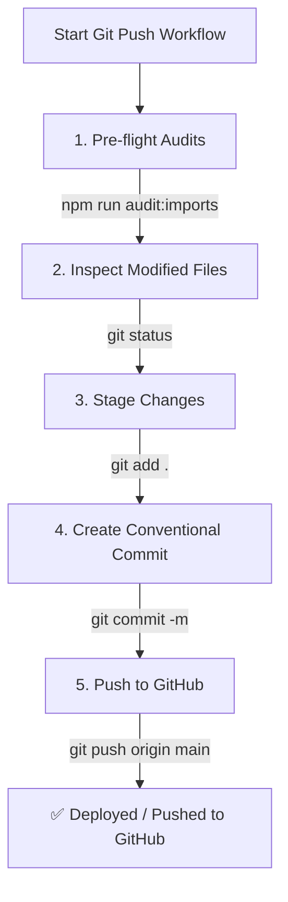

# Git Commit & Push to GitHub Skill

This skill defines the step-by-step workflow for committing verified changes and pushing them to GitHub for **Clon SAP** (`origin/main`).

---

## Workflow Diagram



---

## Execution Steps

### Step 1: Pre-Flight Quality Check
Before staging or committing code, ensure no undeclared imports or broken tests exist:

```bash
npm run audit:imports
npm run test
```

---

### Step 2: Inspect Modified & Untracked Files
Check the repository status to verify which files are changed:

```bash
git status
```

---

### Step 3: Stage Changes
Stage all verified modifications and new skill/rule files:

```bash
git add .
```

---

### Step 4: Create Conventional Commit Message
Formulate a descriptive commit message in Spanish following conventional commit syntax:

* **Format**: `<type>(<scope>): <descripción concisa>`
* **Types**: `feat` (nueva característica), `fix` (corrección), `docs` (habilidades/documentación), `refactor`, `chore`.
* **Example**:
  ```bash
  git commit -m "docs(agents): agregar skills operativas para preflight, backups, simulaciones y git push"
  ```

---

### Step 5: Push to GitHub Remote
Push commits to the remote branch (`origin main`):

```bash
git push origin main
```

---

## Verification
Confirm that local branch is clean and up to date with remote:

```bash
git status
```

Output must show: `nothing to commit, working tree clean`.
