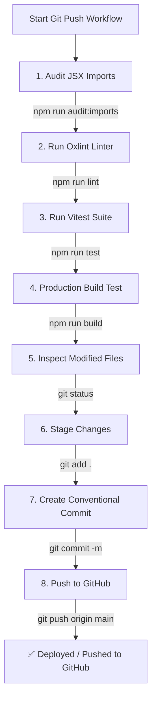

# Git Commit & Push with Pre-Flight Audit Skill

This skill defines the complete, step-by-step pipeline for auditing quality assurance, committing verified changes, and pushing them to GitHub for **Clon SAP** (`origin/main`).

---

## Workflow Diagram


```mermaid
flowchart TD
    A[Start Git Push Workflow] --> B[1. Audit JSX Imports]
    B -->|npm run audit:imports| C[2. Run Oxlint Linter]
    C -->|npm run lint| D[3. Run Vitest Suite]
    D -->|npm run test| E[4. Production Build Test]
    E -->|npm run build| F[5. Inspect Modified Files]
    F -->|git status| G[6. Stage Changes]
    G -->|git add .| H[7. Create Conventional Commit]
    H -->|git commit -m| I[8. Push to GitHub]
    I -->|git push origin main| J[✅ Deployed / Pushed to GitHub]
```

---

## Execution Steps

### Step 1: Pre-Flight Quality Assurance Audit
Before staging or committing code, run the mandatory 4-step QA audit pipeline:

1. **JSX Import Integrity**:
   ```bash
   npm run audit:imports
   ```
   * *Requirement*: All JSX components and Lucide React icons across `src/` must have valid import statements.

2. **Static Analysis (Oxlint)**:
   ```bash
   npm run lint
   ```
   * *Requirement*: Must exit with 0 errors. Fix any syntax issues or invalid JS patterns.

3. **Automated Unit & Integration Tests**:
   ```bash
   npm run test
   ```
   * *Requirement*: All Vitest test suites must pass. Never force a pass by commenting out failing assertions.

4. **Production Build Verification**:
   ```bash
   npm run build
   ```
   * *Requirement*: Vite build must succeed without chunk resolution or compilation failures.

---

### Step 2: Inspect Modified & Untracked Files
Check repository status to verify exact changes:

```bash
git status
```

---

### Step 3: Stage Changes
Stage all verified code modifications, skills, and configuration changes:

```bash
git add .
```

---

### Step 4: Create Conventional Commit Message
Formulate a descriptive commit message in Spanish following conventional commit syntax:

* **Format**: `<type>(<scope>): <descripción concisa>`
* **Types**: `feat` (nueva característica), `fix` (corrección), `docs` (habilidades/documentación), `refactor`, `chore`.
* **Example**:
  ```bash
  git commit -m "docs(agents): consolidar skill de preflight audit en git-commit-push"
  ```

---

### Step 5: Push to GitHub Remote
Push commits to the remote main branch:

```bash
git push origin main
```

---

## Checklist & Verification
Confirm that local branch is clean and up to date with remote:

```bash
git status
```

Output must confirm: `nothing to commit, working tree clean`.
