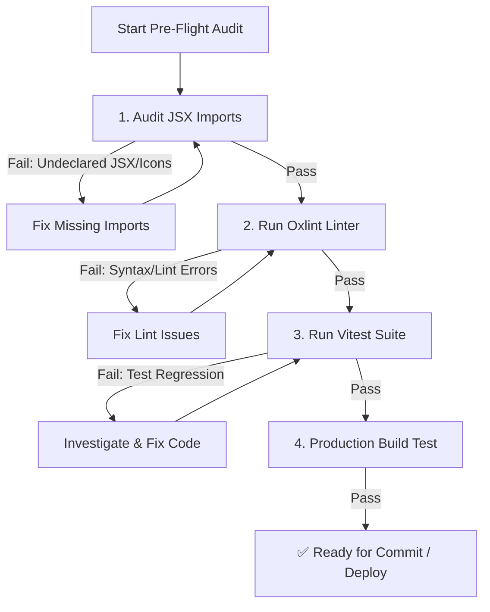

# Pre-Flight Quality Assurance & Audit Skill

This skill outlines the mandatory quality audit pipeline for **Clon SAP / Operam ERP Enterprise**. Run this skill before creating git commits, opening pull requests, or deploying to Firebase Hosting or Supabase.

---

## Audit Pipeline Workflow



---

## Step-by-Step Execution Guide

### Step 1: JSX Import Integrity Audit

Run the automated import safeguard script to detect undeclared JSX components or Lucide React icons across `src/`:

```bash
npm run audit:imports
```

* **What it checks**: Scans all `.jsx` / `.js` files for tags like `<Wrench>`, `<Package>`, `<CreateMaterialModal>` that lack corresponding `import` statements.
* **If it fails**: Add the missing `import { IconName } from 'lucide-react'` or component import in the reported file line, then re-run.

---

### Step 2: Static Analysis with Oxlint

Run Oxlint to catch syntax errors, unused variables, and invalid JS patterns:

```bash
npm run lint
```

* **If warnings/errors occur**: Resolve the identified code issues. Do not disable linter rules unless explicitly requested.

---

### Step 3: Automated Unit & Integration Testing

Run the Vitest test suite:

```bash
npm run test
```

* **Scope**: Tests predictive ML models (`SAPPredictiveML.test.js`), transactional calculations, and service layer logic.
* **Rule**: All tests must pass. Never comment out broken tests or mock around failures to force a pass.

---

### Step 4: Production Build Verification

Verify that Vite can successfully bundle the application:

```bash
npm run build
```

* Ensure no chunk resolution errors, missing dynamic imports, or Tailwind CSS compilation failures occur.

---

## Checklist Summary

- [ ] `npm run audit:imports` exited with code 0 (100% icons and components imported).
- [ ] `npm run lint` reported 0 errors.
- [ ] `npm run test` passed all Vitest suites.
- [ ] `npm run build` generated `/dist` successfully.
