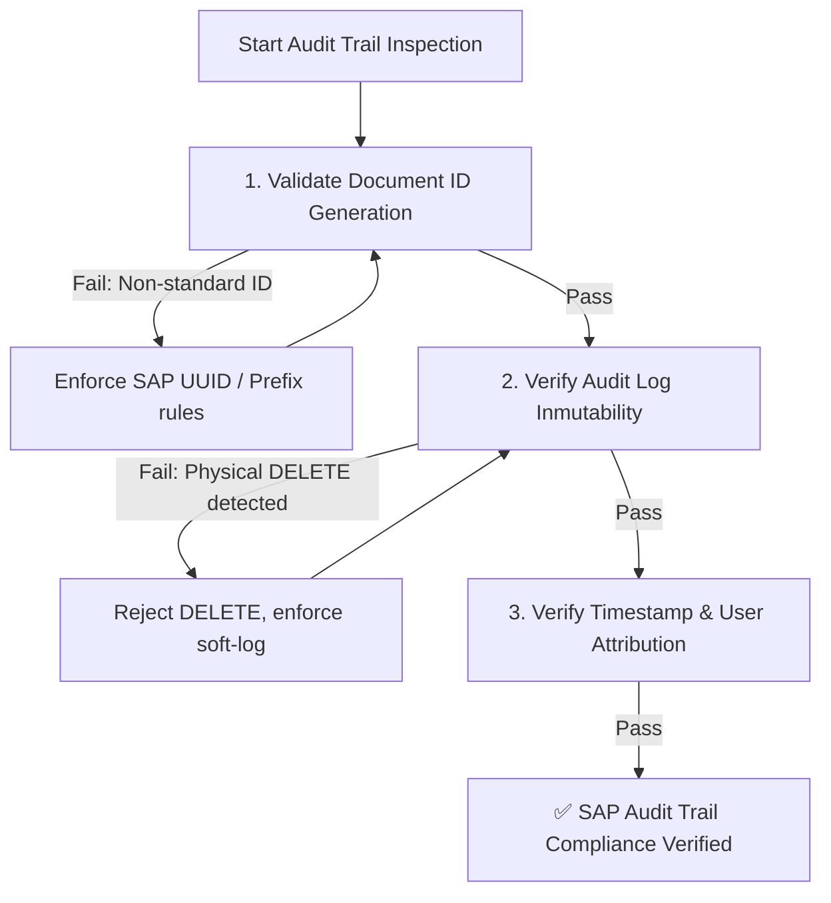

# SAP Transaction Audit Trail Enforcer Skill

This skill defines the mandatory protocol for guaranteeing **immutable audit logging, document traceability, and change tracking** across all transactional modules in **Clon SAP / Operam ERP Enterprise**.

---

## Audit Trail Assurance Workflow



---

## Step-by-Step Execution Protocol

### Step 1: Automated Audit Trail Verification

Execute the automated audit trail inspection script:

```bash
npm run audit:trail
```

* **What it checks**:
  - Ensures no physical `DELETE` calls exist on `audit_logs` or `migo_documents` tables.
  - Verifies that MIGO stock movements, Work Order status changes, and workflow approvals record timestamps (`timestamp` / `created_at`) and user attribution.
* **If it fails**: Eliminate forbidden physical deletion code and ensure immutable audit records are written.

---

## Step 2: SAP Document Naming Conventions

All transactional entities generated in services or UI modals must use SAP standard prefixes:

- **Movement Documents**: `MIGO-87672464` or `MIGO-${timestamp}`
- **Work Orders**: `WO-400101-BHP` or `WO-${randomUUID}`
- **Purchase Orders**: `PO-900210`
- **Requisitions**: `REQ-2026-4160`

*Never use plain sequential numbers like `1`, `2`, `3` to avoid key collision across multiple tenants.*

---

## Step 3: Change Log Standard (CDHDR / CDPOS Compliance)

Whenever updating critical master data or status values (e.g. Work Order state transition `RELEASED` ➔ `CLOSED`):

```javascript
// Example Change Log Injection
const changeRecord = {
  id: crypto.randomUUID(),
  tenant_id: tenantId,
  document_type: 'WORK_ORDER',
  document_id: workOrderId,
  action: 'STATUS_CHANGE',
  old_value: 'RELEASED',
  new_value: 'CLOSED',
  changed_by: user.email,
  timestamp: new Date().toISOString()
};

await supabase.from('audit_logs').insert(changeRecord);
```

---

## Step 4: Compliance Checklist

- [ ] `npm run audit:trail` returns 0 critical errors.
- [ ] No transactional history tables permit hard deletion (`DELETE FROM`).
- [ ] All stock movements (MIGO 261 / 101) write to document history with timestamps.
- [ ] User ID and Tenant ID are attached to every audit trail entry.
