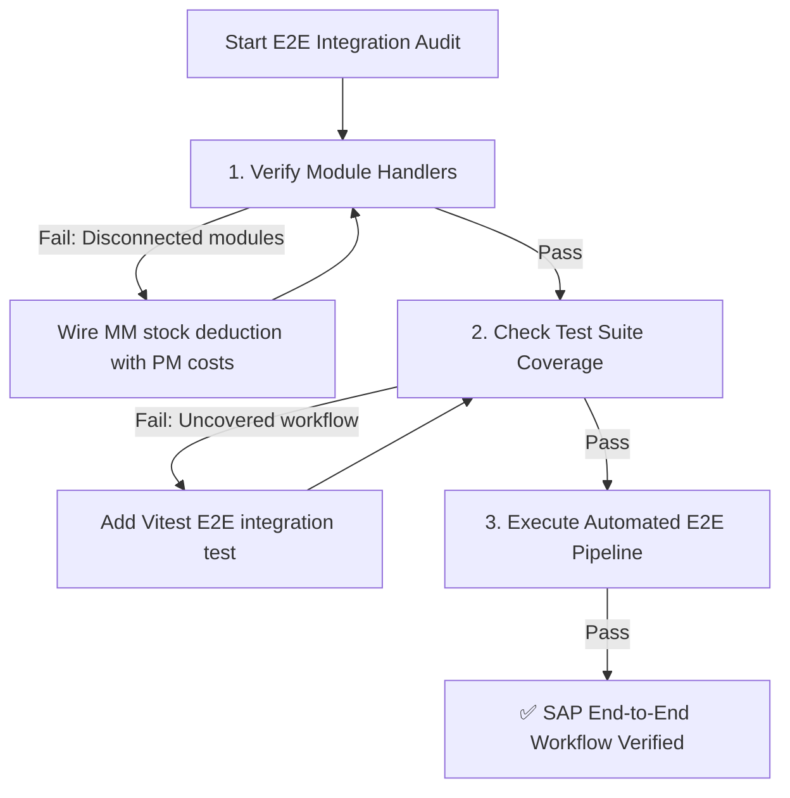

# SAP End-to-End Workflow Tester Skill

This skill outlines the mandatory procedure for verifying cross-module integration and transaction integrity across **Clon SAP / Operam ERP Enterprise**.

---

## E2E Workflow Verification Lifecycle



---

## Step-by-Step Execution Protocol

### Step 1: Automated E2E Workflow Audit

Run the automated E2E pipeline script:

```bash
npm run audit:workflow
```

* **What it checks**:
  - Scans `src/tests/` to guarantee coverage across all major SAP workflows (PM01, MIGO 261, 50 Tenants simulation, stress performance).
  - Executes Vitest end-to-end tests cleanly without race conditions or memory leaks.
* **If it fails**: Fix broken test cases or wire missing service handlers before committing.

---

## Step 2: Integrated Business Rules & Atomic Mutations

When implementing cross-module transactions (e.g., [`GoodsMovementMIGO.jsx`](file:///Users/marcovidallobos/Desktop/Clon%20SAP/src/components/inventory/GoodsMovementMIGO.jsx) ➔ [`CreateWOModal.jsx`](file:///Users/marcovidallobos/Desktop/Clon%20SAP/src/components/modals/CreateWOModal.jsx)):

1. **MIGO 261 Stock Issue to Work Order**:
   - Stock quantity `currentStock` must be deducted atomically (`currentStock - qty`).
   - Work order `actualCost` must be incremented (`actualCost + (unitPrice * qty)`).
   - Document `MIGO-${timestamp}` must be generated and appended to `migo_documents`.

2. **Work Order Status Lifecycle**:
   - Status transitions must follow `CREATED` ➔ `RELEASED` ➔ `IN_PROGRESS` ➔ `TECHNICAL_COMPLETION` (TECO) ➔ `CLOSED`.
   - Cannot issue materials to unreleased or closed work orders.

---

## Step 3: Verification Checklist

- [ ] `npm run audit:workflow` passed with code 0.
- [ ] Cross-module transactions update inventory and cost centers atomically.
- [ ] Multi-tenant isolation is preserved throughout the end-to-end flow.
- [ ] Performance throughput exceeds 1,000 transactions/sec without locks.
