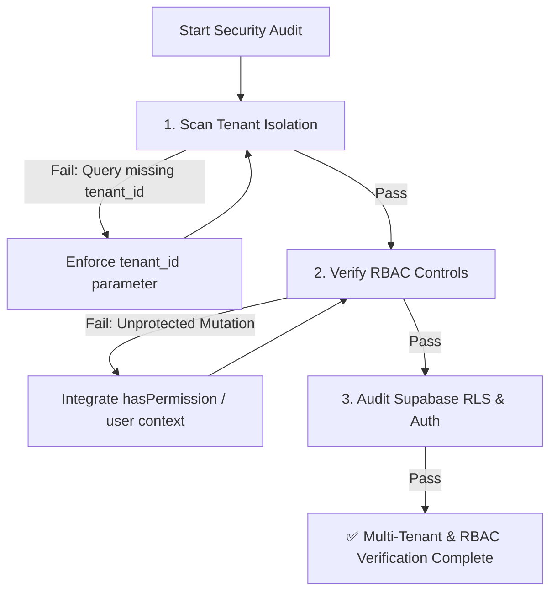

# Multi-Tenant Isolation & RBAC Security Auditor Skill

This skill provides a standardized, multi-step quality assurance and security verification procedure to prevent cross-tenant data leakage and unauthorized privilege escalation across **Clon SAP / Operam ERP Enterprise**.

---

## Security Assurance Workflow



---

## Step-by-Step Security Protocol

### Step 1: Automated Tenant Isolation & RBAC Audit

Run the automated security safeguard script across all services and components:

```bash
npm run audit:security
```

* **What it checks**:
  - Validates that every Supabase query in `src/services/` includes explicit `.eq('tenant_id', tenantId)` filtering or consumes tenant context.
  - Scans sensitive transactional functions (e.g. `delete`, `update`, `approve`, `reject`) to verify they accept `user` / `tenantId` context and invoke `hasPermission` checks.
* **If it fails**: Fix missing `tenant_id` parameters or add permission checks before proceeding.

---

## Step 2: Multi-Tenant Data Isolation Enforcement Rules

When modifying or creating database services in [`src/services/`](file:///Users/marcovidallobos/Desktop/Clon%20SAP/src/services/):

1. **Mandatory Tenant Clause**:
   ```javascript
   const tenantId = user?.tenantId || 'tenant_demo';
   const { data, error } = await supabase
     .from('work_orders')
     .select('*')
     .eq('tenant_id', tenantId);
   ```
2. **Prevent Cross-Tenant Leakage**:
   - Never perform `SELECT`, `UPDATE`, or `DELETE` queries on multi-tenant tables without matching `tenant_id`.
   - Never trust client-supplied ID parameters without verifying they belong to the authenticated user's `tenant_id`.

---

## Step 3: Role-Based Access Control (RBAC) Checks

Wrap UI controls and transactional actions with RBAC checks from [`service_layer_rbac_security.md`](file:///Users/marcovidallobos/Desktop/Clon%20SAP/.agents/rules/service_layer_rbac_security.md):

```javascript
import { hasPermission, PERMISSIONS } from '../utils/rbacRules';

if (!hasPermission(user?.role, PERMISSIONS.MANAGE_INVENTORY)) {
  throw new Error('403 Forbidden: Insufficient privileges for MIGO Goods Movement');
}
```

---

## Step 4: Verification Checklist

- [ ] `npm run audit:security` executed and returned zero critical errors.
- [ ] No hardcoded tenant IDs bypass the authenticated context.
- [ ] Row Level Security (RLS) policies are active on Supabase tables.
- [ ] Destructive UI buttons (Delete / Price Edit / Approval) render disabled or hidden for unauthorized roles (`OPERATOR`, `VIEWER`).
